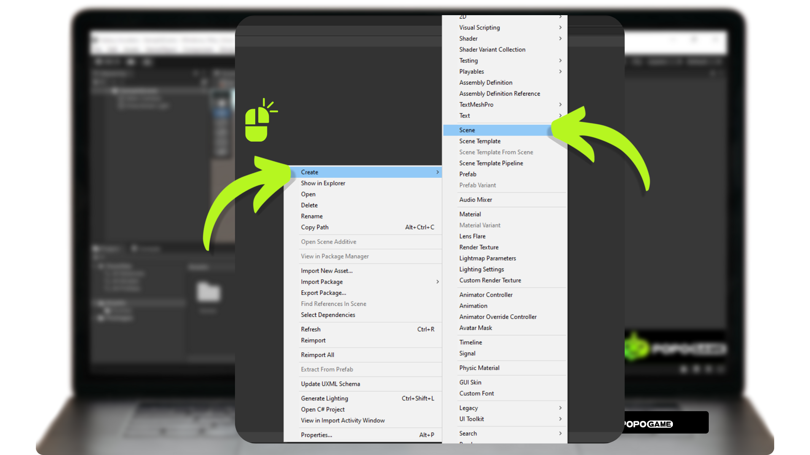
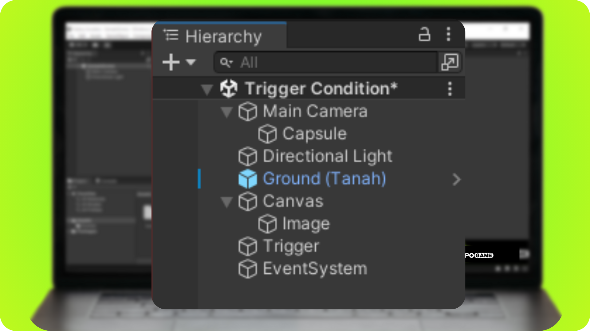
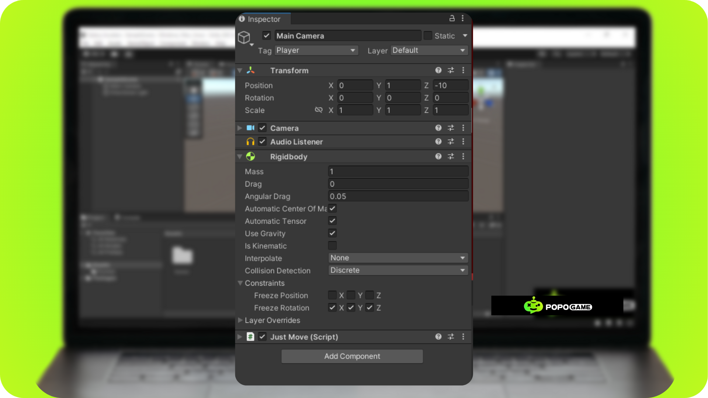
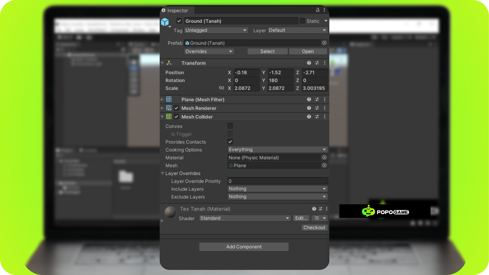
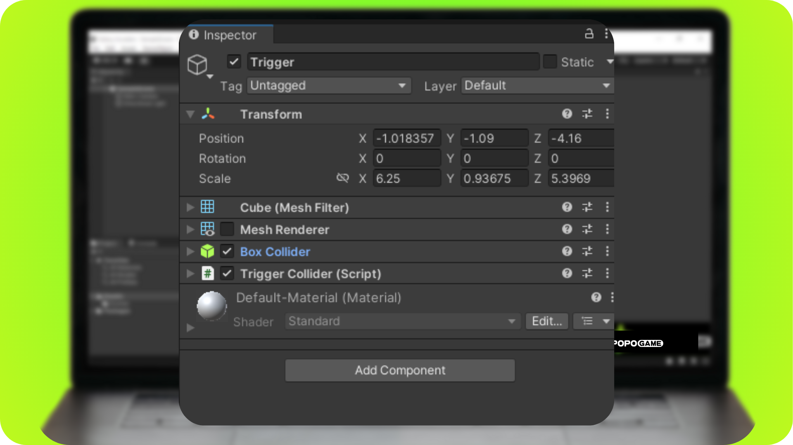
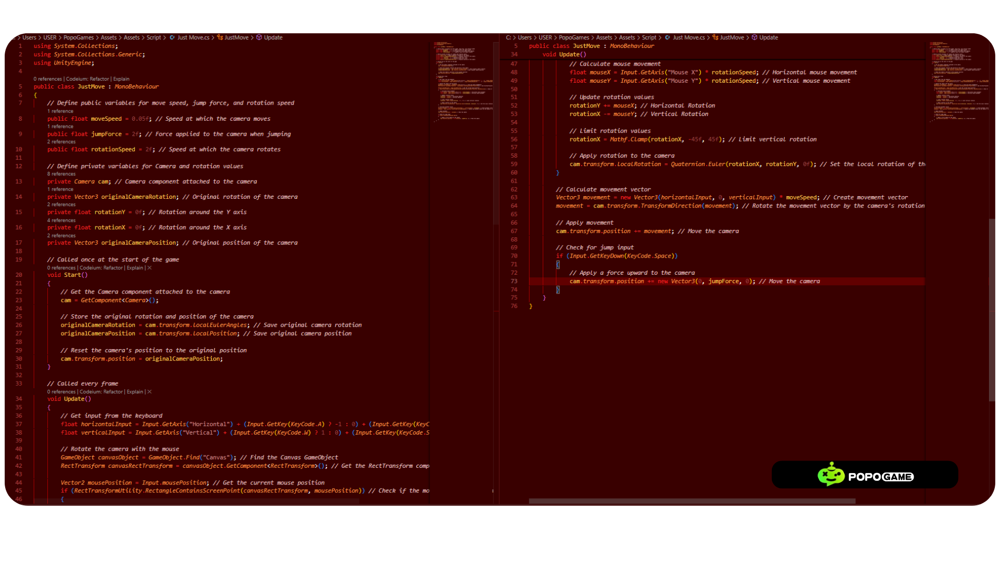
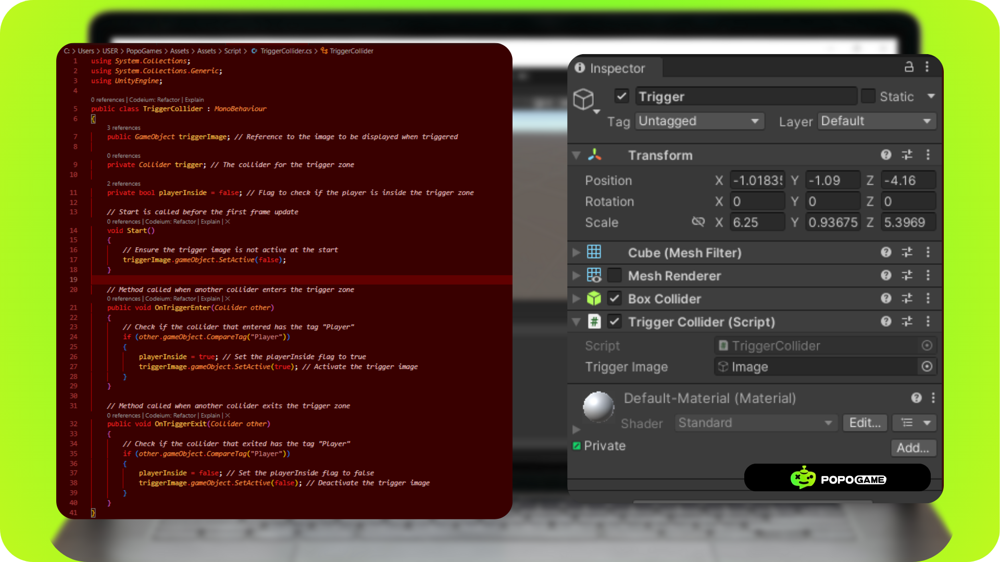

# How to Make Trigger Collider in  Unity

Next, we will create a trigger in Unity that functions to trigger an event or condition within the scene. This trigger is very useful in creating dynamic and interactive gameplay. You can determine various events that will occur when the player enters the trigger zone.

To create the trigger collider, you need several objects:

**1. Camera:** Used to provide visual display and control.

**2. Camera Movement/Character Control:** To manage the movement of the character or camera within the scene.

**3. Collider:** An essential component that enables physical interactions in the game.

**4. Ground:** A supporting component to make the character's movement more realistic.

**5. Trigger Game Object:** The game object that will appear when the player enters the trigger zone. This can be either 3D or 2D (for 2D game objects, you will need a Canvas).

In this tutorial, we will show the steps to set up the trigger collider and provide some examples of events you can create. For example, you can make lights turn on when the player enters a room, doors open automatically, or enemies appear suddenly.

## Creating the Environment

Before we create the environment, we need to create a new scene to house all the necessary game objects. Right-click on the project file window -> Create -> Scene -> name the Scene appropriately -> Double-click on the scene to enter it.

The next step is to add all the gameobjects required to run the trigger collider. Please pay attention to the hierarchy shown, as it is an important part of ensuring everything works correctly and efficiently.

Below are the functions of the game objects added to the scene hierarchy and how to add them to the hierarchy:

**1. Main Camera:**
  - Function: Displays the scene to the player from a certain viewpoint.
  - How to Add: By default, every new scene in Unity already has a Main Camera. If not, you can add it through GameObject > Camera.
  - 
**2. Capsule (Child of the Camera):**
  - Function: A physical object that can represent the player or other objects in the game. As a child of the camera, it will move according to the camera's movement.
  - How to Add: Right-click on the Main Camera in the hierarchy, select 3D Object > Capsule.

**3. Directional Light:**
  - Function: Simulates the main light source in the scene, such as sunlight.
  - How to Add: Select GameObject > Light > Directional Light.

**4. Ground:**
  - Function: Serves as the base or floor surface where other objects can stand or move.
  - How to Add: Select GameObject > 3D Object > Plane and adjust its size as needed.

**5. Canvas:**
  - Function: Holds all UI (User Interface) elements such as buttons, text, and images.
  - How to Add: Select GameObject > UI > Canvas.

**6. Image (Child of Canvas):**
  - Function: Displays an image within the UI.
  - How to Add: Right-click on the Canvas in the hierarchy, select UI > Image.

**7. Game Object Trigger:**
  - Function: An object with a collider that has the "Is Trigger" option enabled, used to detect when other objects enter a certain area.
  - How to Add: Add any object (e.g., Cube) through GameObject > 3D Object > Cube.

**8. Event System:**
  - Function: Manages input and events in the UI, ensuring that UI elements can receive input from the user.
  - How to Add: Select GameObject > UI > Event System. Unity usually adds this automatically when you add your first UI element.

## Adding All Components to GameObjects

After inserting all the gameobjects into the scene hierarchy, the next step is to add components to these gameobjects to make them functional for our game development. We start from the top of the hierarchy, which is the Main Camera.

The Main Camera needs a script to control the camera movement and a Rigidbody to make the camera react to gravity. First, add the script by clicking on the "Add Component" button -> "New Script" -> Name the script "JustMove" -> Click "Create and Add". Once the script is created, click "Add Component" again -> "Rigidbody" -> Check the "Freeze Rotation X Y Z" constraints. Don't forget to change the tag to "Player". If the "Player" tag is not available, you can create it first. The end result will be both components added to the Main Camera game object.

## For the GameObjects Capsule, Directional Light, Canvas, Image, and EventSystem, there are no additional components to be added.

The GameObject Ground or Plane needs a collider to be added. You are free to choose between a mesh collider or a box collider by clicking the Add Component button -> Mesh/Box Collider.

Next, we need to adjust the Trigger game object. Here, we need to check the "Is Trigger" option on the Box Collider component and uncheck the Mesh Renderer so that the game object is not visible when the game is played. Then, we need to add a trigger script by clicking the Add Component button -> New Script -> Name the script "TriggerCollider" -> Click the Create and Add button.

## Creating a Movement Script

This script will handle the player's movement, including moving forward, backward, left, right, and jumping. Open the script you created previously and apply the script below to your script. Make sure the class name is the same; otherwise, the script will not work. You can also refer to the documentation within the script for further development.

## Creating a Trigger Script

This script will handle the trigger generated when a game object with the "Player" tag enters the trigger zone. Please open the script you have previously created by double-clicking the script in the component or project window and apply the script below to it. Make sure the class name is the same; otherwise, the script will not work. You can also refer to the documentation within the script for further development.

After that, you insert the gameobject that will appear when the player enters the trigger zone. Then, save and run the program.
